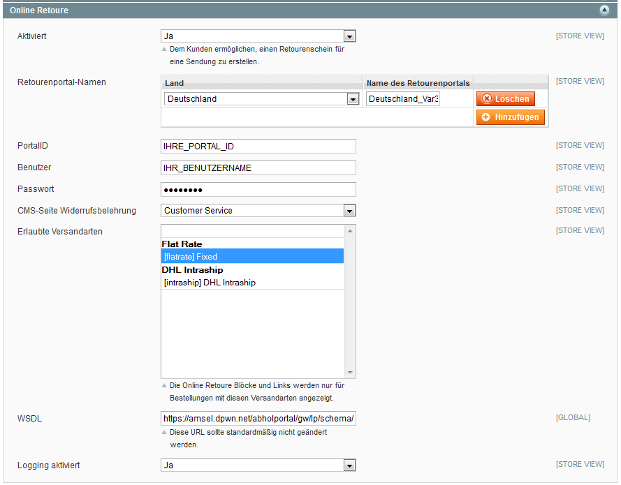
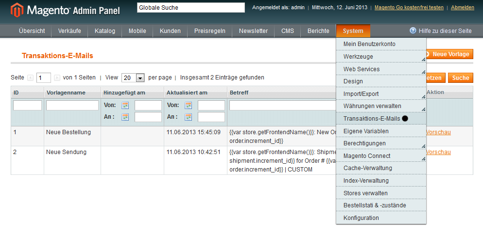
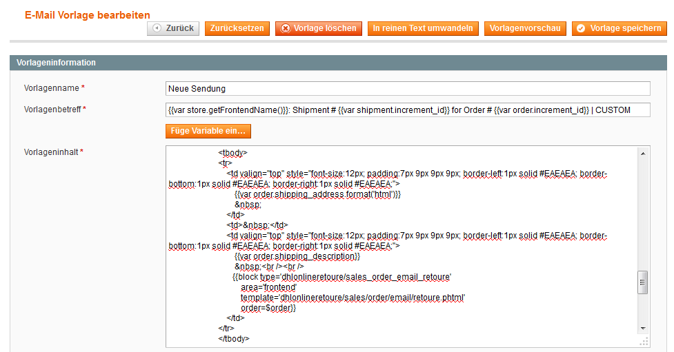
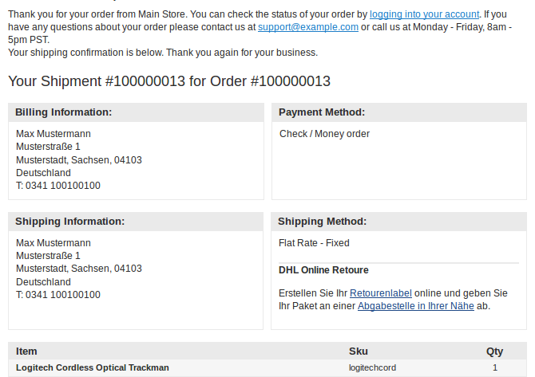
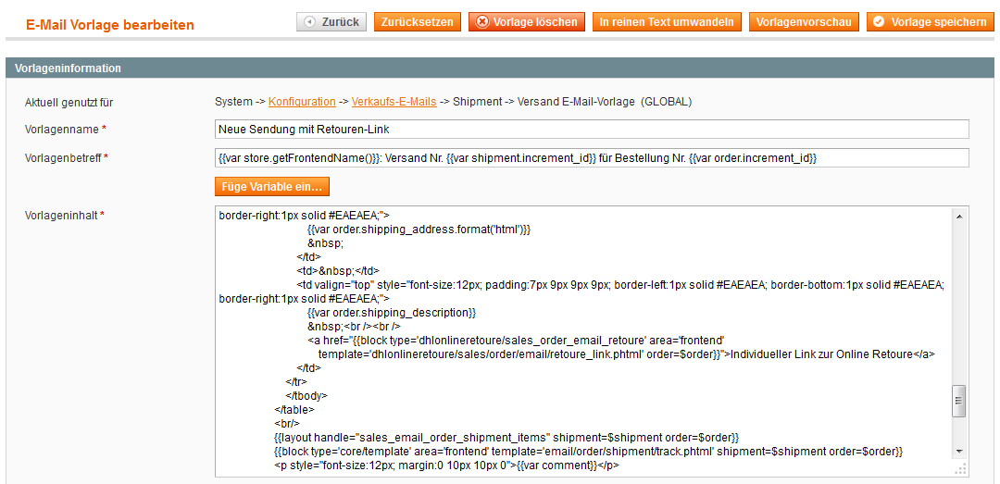
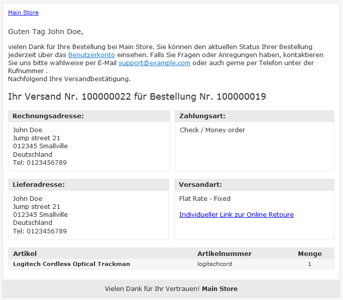
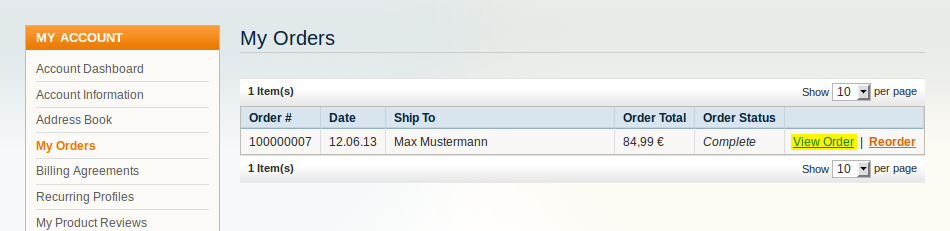
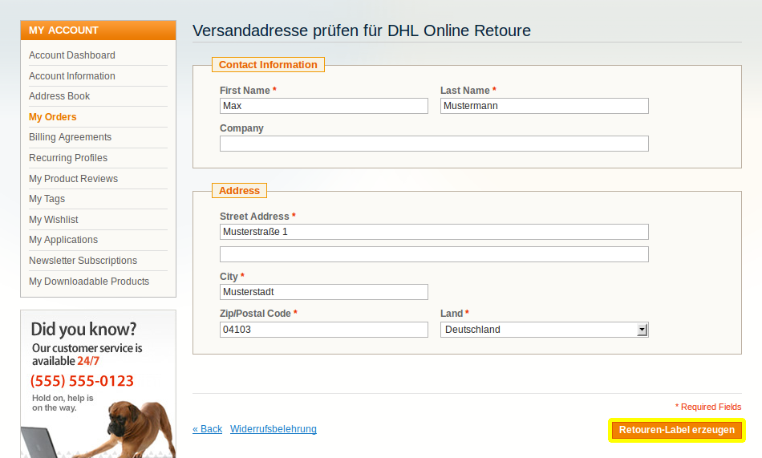
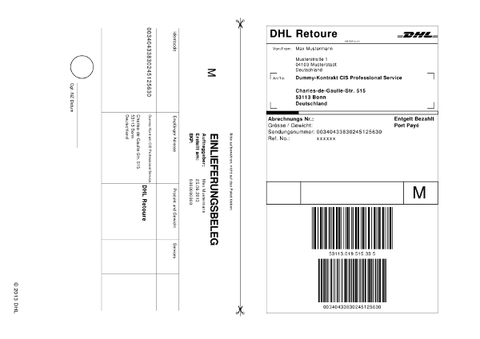
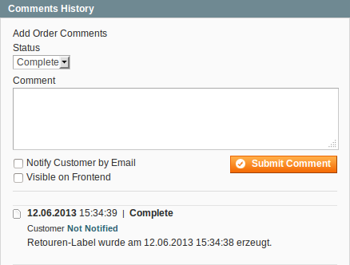

.. |date| date:: %d/%m/%Y
.. |year| date:: %Y

.. footer::
   .. class:: footertable

   +-------------------------+-------------------------+
   | Stand: |date|           | .. class:: rightalign   |
   |                         |                         |
   |                         | ###Page###/###Total###  |
   +-------------------------+-------------------------+

.. header::
   .. image:: images/dhl.jpg
      :width: 4.5cm
      :height: 1.2cm
      :align: right

.. sectnum::

======================================================================================================
DHL Online Retoure - Magento Extension zur Erstellung der Retouren-Labels durch den Kunden im Frontend
======================================================================================================

.. raw:: pdf

   PageBreak

.. contents:: DHL Online Retoure - Endbenutzer-Dokumentation

.. raw:: pdf

   PageBreak

Voraussetzungen
===============

Folgende Voraussetzungen müssen für den reibungslosen Betrieb des DHL-OnlineRetoure-Moduls erfüllt sein.

Magento
-------

Folgende Magento-Versionen werden vom Modul unterstützt bzw. vorausgesetzt:

- Community-Edition 1.7, 1.8, 1.9
- Enterprise-Edition 1.12, 1.13, 1.14

Server
------

- Auf dem Server muss PHP in der Version 5.5 oder höher installiert sein.
- Die SOAP-Extension muss auf dem Webserver installiert und aktiviert sein.

Konfiguration
=============

   Magento Backend - Konfigurationsbereich

Der Konfigurationsbereich der Extension ist unter System -> Konfiguration -> Sales -> Versandeinstellungen -> Online Retoure erreichbar.

.. list-table:: DHL OnlineRetoure Konfigurationsbereich
   :widths: 15 30
   :header-rows: 1

   * - Konfiguration
     - Kommentar
   * - Aktiviert
     - Sofern deaktiviert, wird weder der Retourenlink unter "Mein Konto" angezeigt,
       noch der Retouren-Block in den Transaktions-E-Mails eingefügt.
   * - Retourenportal-Namen
     - Für jedes Land aus dem Retouren akzeptiert werden sollen, ist der Name des Retouren-Portals anzugeben.
       Sie finden den jeweiligen Retourenportal-Namen (deliveryName) in der Aufschalt-E-Mail zur Retoure Online von DHL.
   * - Portal ID
     - Ihre Portal ID im DHL Retourenportal. Sie finden Ihre Portal ID in der Aufschalt-E-Mail.
   * - Benutzer
     - Ihr Benutzername im DHL Retourenportal. Sie finden Ihren Benutzernamen in der Aufschalt-E-Mail.
   * - Passwort
     - Ihr Passwort im DHL Retourenportal. Den Link zur Erstellung Ihres Passworts finden Sie in der Aufschalt-E-Mail.
   * - CMS-Seite Widerrufsbelehrung
     - Ein Link zu dieser CMS-Seite wird auf der Retouren-Seite angezeigt.
   * - Erlaubte Versandarten
     - Die Retouren-Funktion ist nur für Bestellungen, die mit den hier ausgewählten Versandarten getätigt wurden, aktiv.
   * - WSDL
     - Die URL zum Retouren-Gateway. Diese sollte standardmäßig nicht geändert werden.
   * - Logging aktiviert
     - Sofern aktiv, erstellt das Modul Log-Einträge für ausgehende und eingehende Requests in der Datei "var/log/dhl_retoure.log".
       Diese Datei ist hilfreich im Support, um etwaige Probleme schneller identifizieren und lösen zu können.

.. raw:: pdf

   PageBreak

Integration in Transaktions-E-Mails
===================================

Die Transaktions-E-Mails von Magento können unter "System"->"Transaktions-E-Mails" angepasst und bearbeitet werden.

   Magento Backend - Transaktions-E-Mails

Retouren Block
--------------

Um den Info-Block zur Erstellung der Retouren-Labels in die Transaktions-E-Mails einzubinden,
muss folgender Code-Block in die Transaktions-E-Mails von Magento eingebaut werden.

 {{block type='dhlonlineretoure/sales_order_email_retoure'
     area='frontend'
     template='dhl_onlineretoure/sales/order/email/retoure.phtml'
     order=$order}}

Eine geeignete Position wäre unter den Versand-Informationen, welche in den Templates der Transaktions-E-Mails mittels
des Platzhalters {{var order.getShippingDescription()}} eingebunden werden.

   Magento Backend - Integration des Online Retoure Blocks in das E-Mail-Template "Neue Sendung"

   E-Mail - Neue Sendung mit Retouren-Block

Geeignet und getestet wurde die Integration in folgende Transaktions-E-Mails:

- Neue Sendung
- Neue Sendung (Gast)

Der Code-Block funktioniert jedoch grundsätzlich in allen Transaktions-E-Mails, bei denen die Bestellung mittels der Funktion getOrder()
bzw. als Variable $order vorliegt.

Das Template "dhl_onlineretoure/sales/order/email/retoure.phtml" befindet sich im Standard-Pfad base/default und kann regulär in Ihrem
Custom Template überschrieben werden. Alternativ können Sie im Code-Block auch einen komplett anderen Template-Pfad angeben.

Retouren Link
-------------

Wenn Sie nur den Link zum Retouren-Formular einbinden möchten, können Sie anstatt des Templates "dhl_onlineretoure/sales/order/email/retoure.phtml"
das Template "dhl_onlineretoure/sales/order/email/retoure_link.phtml" verwenden.

 <a href="{{block type='dhlonlineretoure/sales_order_email_retoure' area='frontend'  template='dhl_onlineretoure/sales/order/email/retoure_link.phtml' order=$order}}">Individueller Link zur Online Retoure</a>

   Magento Backend - Integration des Online Retoure Links in das E-Mail-Template "Neue Sendung"

   E-Mail - Neue Sendung mit Retouren-Link

Erzeugen des Retoure-Labels
===========================

Für die Erzeugung eines Retoure-Labels durch den Kunden sind allgemein folgende
Schritte erforderlich:

#. Abschnitt *Meine Bestellungen* im Kundenbereich öffnen
#. Zu retournierende Bestellung öffnen
#. _`Versandadresse prüfen` und ggf. korrigieren
#. Labelerzeugung initiieren

Zu beachten ist, dass der Link zur Erzeugung einer Online Retoure nur
eingeblendet wird, wenn folgende Bedingungen erfüllt sind:

- Die Bestellung, zu der ein Retoure-Label erzeugt werden soll, existiert
- Zu der Bestellung wurde bereits eine Sendung erzeugt
- Der Kunde ist im Kundenbereich angemeldet
- Die Bestellung wurde durch den angemeldeten Kunden aufgegeben
- Es wurde ein Retourenportal für die Lieferadresse (Land) konfiguriert
- Die ursprünglich verwendete Versandart wurde via Konfiguration für DHL Online Retoure freigegeben

Wird die Erzeugung des Labels nicht aus dem Kundenbereich sondern einer E-Mail
heraus aufgerufen (siehe Kapitel `Integration in Transaktions-E-Mails`_), wird bei
Schritt `Versandadresse prüfen`_ begonnen. In diesem Fall ist weder eine Anmeldung im Kundenbereich
erforderlich noch wird geprüft ob die Bestellung durch den angemeldeten Kunden aufgegeben wurde.

Das Adressformular wird angezeigt, wenn die oben genannten Bedingungen erfüllt sind.

   Bestellung öffnen

.. figure:: onlineretoure/screenshots/createlabel-02-order_view.png
   :width: 16cm

   Retoure-Link betätigen

   Versandadresse prüfen

   Retoure-Label

Sobald ein Retoure-Label durch den Kunden erfolgreich erzeugt wurde, erhält der
Händler darüber einen Hinweis im Kommentarverlauf einer Bestellung.

   Eintrag im Kommentarverlauf
