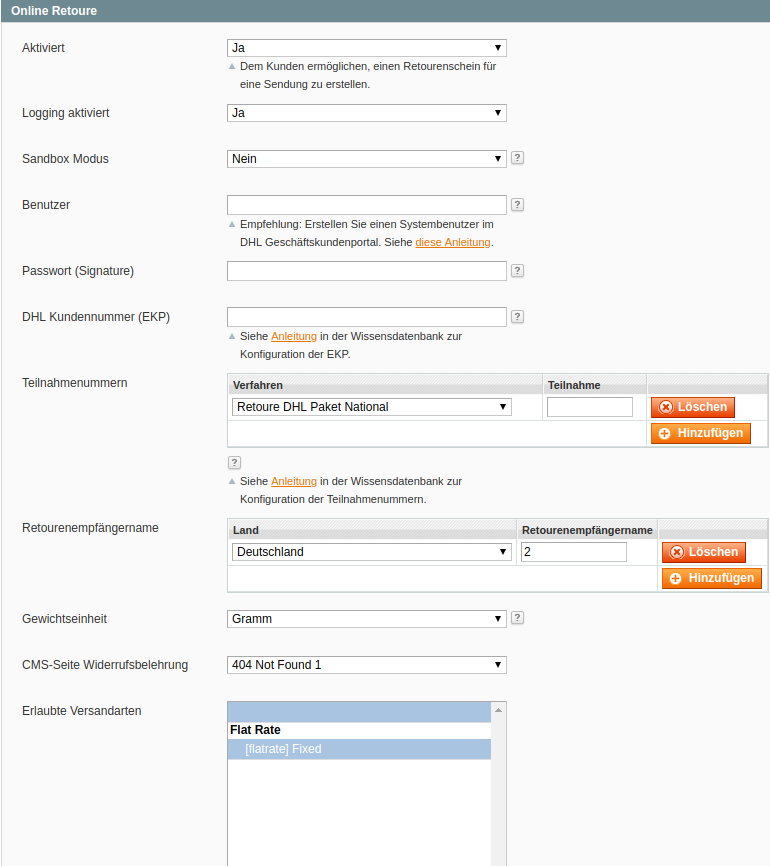
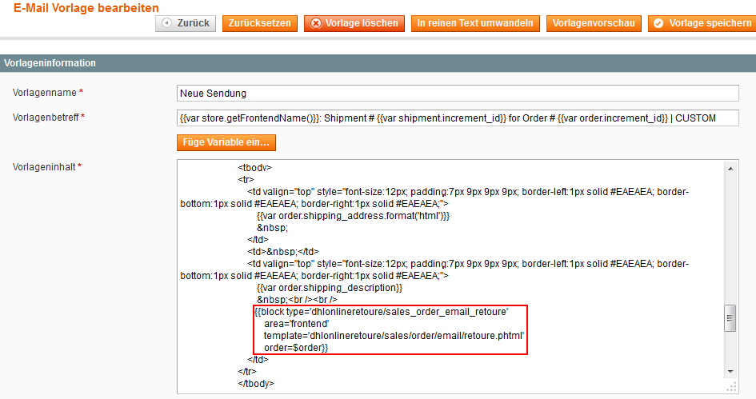
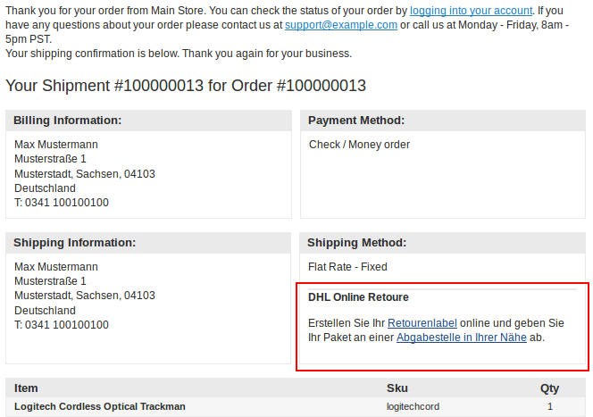
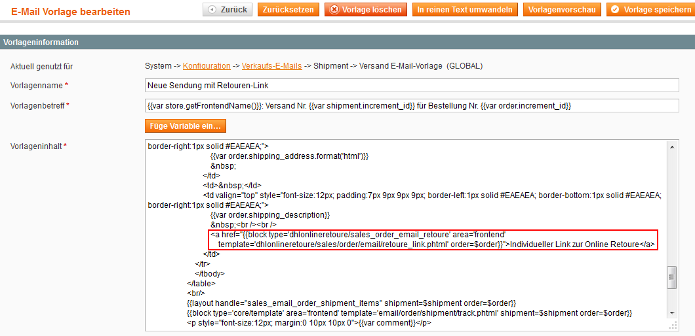
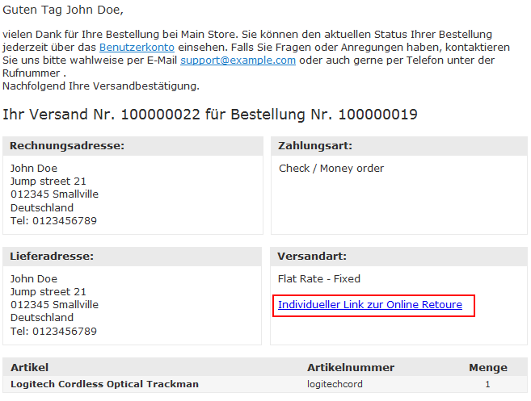
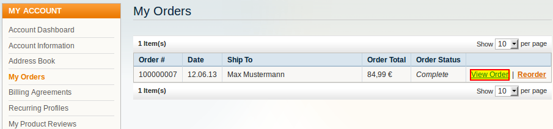
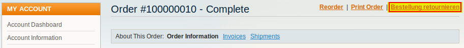
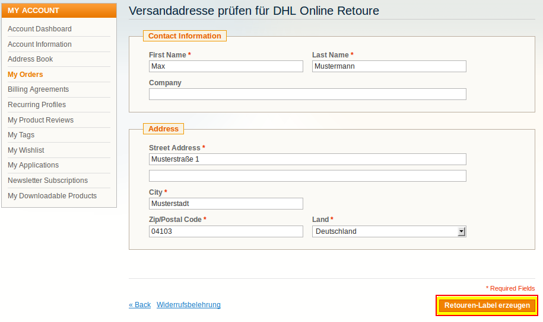
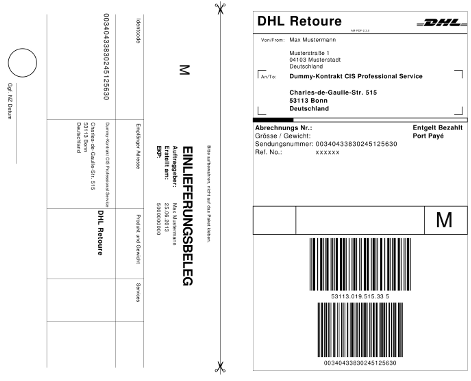
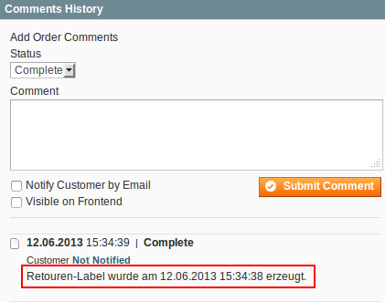

.. |date| date:: %d/%m/%Y
.. |year| date:: %Y

.. footer::
   .. class:: footertable

   +-------------------------+-------------------------+
   | Stand: |date|           | .. class:: rightalign   |
   |                         |                         |
   |                         | ###Page###/###Total###  |
   +-------------------------+-------------------------+

.. header::
   .. image:: images/dhl.jpg
      :width: 4.5cm
      :height: 1.0cm
      :align: right

.. sectnum::

=================================
DHL Online Retoure für Magento® 1
=================================

Mittels der Extension *DHL Online Retoure* für Magento® 1 können Ihre Kunden direkt im Shop
ein Retouren-Label für Bestellungen erzeugen und selbst ausdrucken. Darüber hinaus kann
ein QR-Code heruntergeladen werden, mit denen ein Paketaufkleber in der Einlieferungsstelle
(Postfiliale, Paketshop) gedruckt werden kann.

Diese Anleitung erklärt die **Installation, Konfiguration und Nutzung** der Extension.

.. raw:: pdf

   PageBreak

.. contents:: Installation, Konfiguration und Nutzung

.. raw:: pdf

   PageBreak

Voraussetzungen
===============

Folgende Voraussetzungen müssen für den reibungslosen Betrieb der Extension erfüllt sein.

Magento®
--------

Folgende Magento®-Versionen werden von der Extension unterstützt:

- Community-Edition (Open Source) 1.7, 1.8, 1.9
- Enterprise-Edition (Commerce) 1.12, 1.13, 1.14

Server
------

- Auf dem Server muss PHP 5.5 oder höher installiert sein.
- Die PHP Extensions JSON und GD müssen installiert und aktiviert sein.

Hinweise zur Verwendung der Extension
========================================

Sprachunterstützung
-------------------

Die Extension unterstützt die Lokalisierungen *en_US* und *de_DE*. Die Übersetzungen
sind in den CSV-Übersetzungsdateien gepflegt und somit auch durch Dritt-Extensions anpassbar.

Datenschutz
-----------

Durch die Extension werden personenbezogene Daten an DHL übermittelt, die zur Verarbeitung des Auftrags
erforderlich sind (Namen, Anschriften, etc.).

Der Händler muss sich vom Kunden das Einverständnis zur Verarbeitung der Daten einholen,
beispielsweise über die AGB des Shops und / oder eine Einverständniserklärung im Checkout (Magento®
Checkout Agreements / Terms and Conditions).

Installation
============

Wenn Sie das Modulpackage via `Magento Marketplace <https://marketplace.magento.com/dhl-dhl-onlineretoure.html>`_
bezogen haben, dann installieren Sie es wie gewohnt über den Magento Connect Manager unter Nutzung des
Extension Keys "Dhl_OnlineRetoure".

Darüber hinaus steht die `DHL Online Retoure Extension auf GitHub <https://github.com/netresearch/dhl-online-retoure-m1>`_
zur Installation via `Composer <https://getcomposer.org/>`_ zur Verfügung.

Konfiguration
=============

Der **Konfigurationsbereich** der Extension ist hier zu finden:

::

  System → Konfiguration → Verkäufe → Versandeinstellungen → Online Retoure

Folgende **Einstellungen** können vorgenommen werden:

.. list-table::
   :widths: 15 30
   :header-rows: 1

   * - Name
     - Beschreibung
   * - Aktiviert
     - Aktivieren, damit der Retourenlink in der Bestellansicht im Kundenbereich und in den Transaktions-E-Mails (sofern konfiguriert) angezeigt wird.
   * - Logging aktiviert
     - Aktivieren, damit Log-Einträge in die Datei *var/log/dhl_retoure.log* geschrieben werden.
       Dies ist hilfreich, um Probleme schneller identifizieren und lösen zu können. **Empfehlung: nur zur Fehlersuche aktivieren.**
   * - Sandbox-Modus
     - Im Sandbox-Modus können die Funktionen getestet werden, ohne Benutzername, Passwort oder DHL Kundennummer einzugeben.
   * - Benutzer
     - Benutzer aus dem DHL Geschäftskundenportal. **Benutzer muss zur Rücksendung berechtigt sein!**
   * - Passwort (Signature)
     - Passwort für den DHL Webservice (API). Dieses kann im DHL Geschäftskundenportal erstellt werden.
   * - DHL Kundennummer (EKP)
     - Ihre DHL Kundennummer aus dem DHL Geschäftskundenportal.
   * - Teilnahmenummern
     - Die letzten beiden Zeichen der Abrechnungsnummer für das jeweilige Produkt
   * - Retourenempfängername
     - Retourenempfänger ("Receiver IDs") können über die Auswahl "Einstellungen" des Menüpunkts "Retoure" im DHL Geschäftskundenportal editiert werden.
   * - Gewichtseinheit
     - Geben Sie die Einheit für das im Katalog verwendete Produktgewicht an.
   * - CMS-Seite Widerrufsbelehrung
     - Ein Link zu dieser CMS-Seite wird dem Kunden bei Erstellung einer Retoure angezeigt.
   * - Erlaubte Versandarten
     - Wählen Sie aus, für welche Versandarten Retouren erstellt werden können.

.. raw:: pdf

   PageBreak

Integration in Transaktions-E-Mails
===================================

Sie können den Transaktions-E-Mails einen Link hinzufügen, über den der Kunde direkt ein Retouren-Label erzeugen kann,
ohne sich im Shop anzumelden.

Die Transaktions-E-Mails von Magento® können im Admin Panel hier anpepasst werden:

::

  System → Transaktions-E-Mails

Retouren Block
--------------

Um den Block zur Erstellung der Retouren-Labels in die Transaktions-E-Mails einzubinden,
muss folgender Code in die E-Mail-Templates von Magento® eingebunden werden:

::

  {{block type='dhlonlineretoure/sales_order_email_retoure'
    area='frontend'
    template='dhl_onlineretoure/sales/order/email/retoure.phtml'
    order=$order}}

Eine geeignete Position wäre z.B. unter den Versand-Informationen.

**Beispiel:**

.. raw:: pdf

   PageBreak

**Ausgabe in E-Mail:**

Die Integration in folgende Transaktions-E-Mails wurde getestet:

* Neue Sendung
* Neue Sendung (Gast)

Das Template "dhl_onlineretoure/sales/order/email/retoure.phtml" befindet sich im Standard-Pfad base/default und kann regulär in Ihrem
Custom Template überschrieben werden. Alternativ können Sie im Code-Block auch einen komplett anderen Template-Pfad angeben.

Der Code-Block funktioniert jedoch grundsätzlich in allen Transaktions-E-Mails, bei denen die Bestellung über die
Funktion *getOrder()* bzw. als Variable *$order* vorliegt.

.. raw:: pdf

   PageBreak

Retouren Link
-------------

Wenn Sie nur den Link zum Retouren-Formular einbinden möchten, nicht den gesamten Block, können Sie dieses Template
verwenden: *"dhl_onlineretoure/sales/order/email/retoure_link.phtml"*

::

  <a href="{{block type='dhlonlineretoure/sales_order_email_retoure'
    area='frontend' template='dhl_onlineretoure/sales/order/email/retoure_link.phtml'
    order=$order}}">Individueller Link zur Online Retoure</a>

**Beispiel:**

**Ausgabe in E-Mail:**

Workflow
========

Erzeugen von Retouren-Labels im Kundenkonto
----------------------------------------------

Für die Erzeugung eines Retouren-Labels im Kundenkonto sind folgende Schritte erforderlich:

* Im Shop-Frontend einloggen
* Abschnitt *Meine Bestellungen* im Kundenkonto öffnen

* Zu retournierende Bestellung öffnen und Retouren-Link anklicken

* Versandadresse prüfen und ggf. korrigieren
* *Retouren-Label erzeugen* anklicken

.. raw:: pdf

   PageBreak

* PDF-Datei herunterladen, öffnen und Label ausdrucken
* Alternativ den QR-Code in einer DHL-Einlieferungsstelle vorzeigen, um dort das Label ausdrucken zu lassen

Sobald ein Retouren-Label erzeugt wurde, erscheint im Magento® Adminpanel ein Hinweis in den Bestellkommentaren.

**Bitte beachten:**

Der Link zur Erzeugung einer Online Retoure wird im Kundenbereich nur eingeblendet, wenn:

* die Bestellung, zu der ein Retoure-Label erzeugt werden soll, existiert,
* zu der Bestellung bereits eine Sendung erzeugt wurde,
* der Kunde im Kundenbereich angemeldet ist,
* die Bestellung durch den angemeldeten Kunden aufgegeben wurde,
* ein Retourenempfänger für die Absenderadresse (Land des Kunden) konfiguriert ist,
* die verwendete Versandart in der `Konfiguration`_ mit *DHL Online Retoure* verknüpft ist.

.. raw:: pdf

   PageBreak

Erzeugen von Retouren-Labels per E-Mail-Link
--------------------------------------------

Klickt der Kunde auf den Retouren-Link in einer Transaktions-E-Mail, ist der Workflow nahezu gleich
zum `Erzeugen von Retouren-Labels im Kundenkonto`_.

Der Kunde muss sich dazu nicht im Shop anmelden. Die Verfügung über den Link genügt, um ein Retouren-Label zu erzeugen.

Siehe auch `Integration in Transaktions-E-Mails`_.

Deinstallation
==============

Zur Deinstallation gehen Sie wie folgt vor:

* Entfernen Sie alle Moduldateien aus Ihrer Magento-Installation.
* Widerrufen Sie die Anzeigeberechtigungen für Blöcke unter *System → Berechtigungen → Blöcke*.
* Entfernen Sie alle zum Modul gehörenden Datenbankeinträge.

::

    DELETE FROM `core_config_data` WHERE `path` LIKE 'shipping/dhlonlineretoure/%';
    DELETE FROM `core_resource` WHERE `code` = 'dhl_onlineretoure_setup';

Technischer Support
===================

Wenn Sie Fragen haben oder auf Probleme stoßen, werfen Sie bitte zuerst einen Blick in das
Support-Portal (FAQ): http://dhl.support.netresearch.de/

Sollte sich das Problem damit nicht beheben lassen, können Sie das Support-Team über das o.g.
Portal oder per Mail unter dhl.support@netresearch.de kontaktieren.
