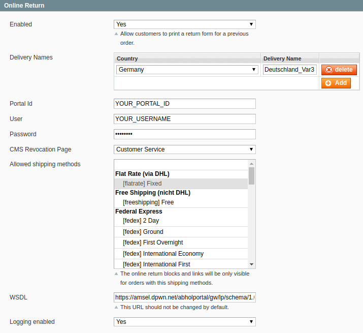
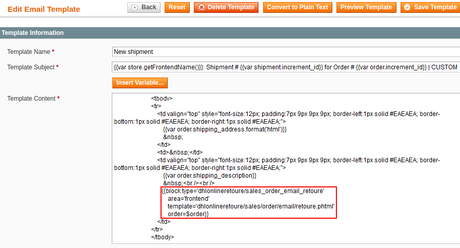
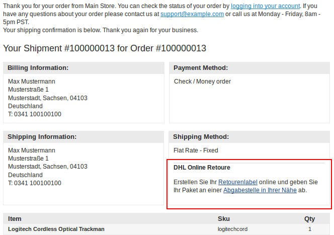
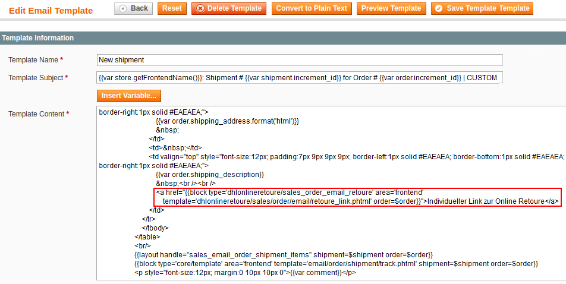
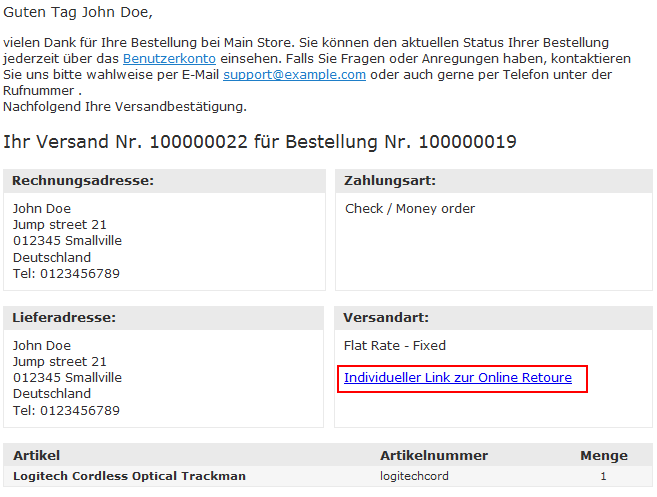
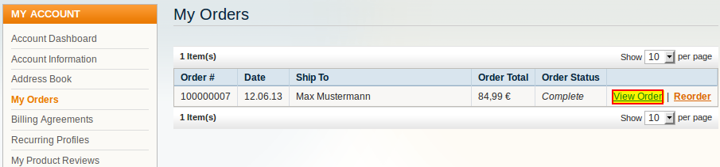
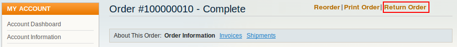
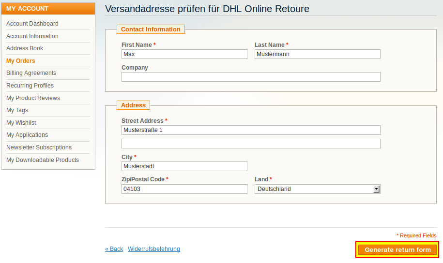
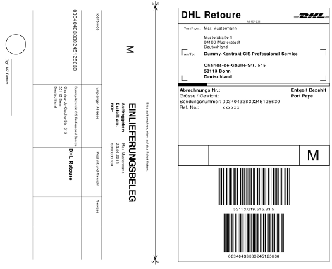
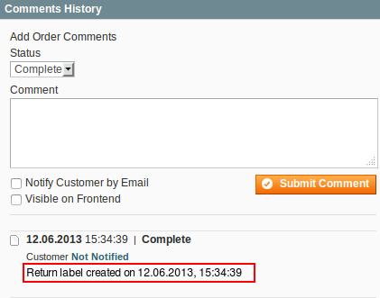

.. |date| date:: %d/%m/%Y
.. |year| date:: %Y

.. footer::
   .. class:: footertable

   +-------------------------+-------------------------+
   | Stand: |date|           | .. class:: rightalign   |
   |                         |                         |
   |                         | ###Page###/###Total###  |
   +-------------------------+-------------------------+

.. header::
   .. image:: images/dhl.jpg
      :width: 4.5cm
      :height: 1.2cm
      :align: right

.. sectnum::

=========================================
DHL Online Returns for Magento® 1
=========================================

The extension *DHL Online Returns* for Magento® 1 allows customers to create return labels in the shop and
print these themselves.

This documentation covers the **installation, configuration, and usage** of the extension.

.. raw:: pdf

   PageBreak

.. contents:: Installation, configuration, and usage

.. raw:: pdf

   PageBreak

Requirements
===============

The following requirements must be met for a smooth operation of the extension.

Magento®
--------

The following Magento® versions are supported:

- Community-Edition (Open Source) 1.7, 1.8, 1.9
- Enterprise-Edition (Commerce) 1.12, 1.13, 1.14

Server
------

- PHP 5.5 or higher must be installed on the server.
- The PHP SOAP extension must be installed and enabled.

Hints for using the module
========================================

Language support
-------------------

The module supports the locales *en_US* and *de_DE*. The translations are stored
in CSV translation files and can therefore be modified by third-party modules.

Data protection
---------------

The module transmits personal data to DHL which are needed to process the shipment (names,
addresses, etc.).

The merchant needs the agreement from the customer to process the data, e.g. via the shop's
terms and conditions and / or an agreement in the checkout (Magento® Checkout Agreements).

Installation
============

Install the module according to the instructions from the file *readme.md* which you can
find in the module package. It is very important to follow all steps exactly as shown there.
Do not skip any steps.

The file *readme.md* also describes the database changes which are made during installation.

Configuration
=============

The **configuration** for the extension can be found here:

::

  Configuration → Sales → Shipping settings → Online Return

You can configure these **settings**:

.. list-table::
   :widths: 15 30
   :header-rows: 1

   * - Name
     - Description
   * - Enabled
     - Enable this to show the return link in "My account" and in the transactional emails (if configured).
   * - Delivery names
     - For every **country** from which returns are accepted, you need to set the **delivery name** (return portal).
       The delivery names can be found in the registration email from DHL.
   * - Portal ID
     - Your Portal ID for the DHL Return Portal. You can find the ID in the registration email from DHL.
   * - User
     - Your username for the DHL Return Portal.  You can find the username in the registration email from DHL.
   * - Password
     - Your password for the DHL Return Portal. You must create this password yourself. The link to create it can be
       found in the registration email from DHL.
   * - CMS revocation page
     - A link to this CMS page will be displayed to the customer when creating a return label.
   * - Allowed shipping methods
     - Select which shipping methods should be allowed for returns.
   * - WSDL
     - The URL to the DHL Return Gateway. This should normally not be changed.
   * - Logging enabled
     - Enable this to log outgoing and incoming requests to the file *var/log/dhl_retoure.log*. This is helpful to
       identify and resolve problems. **Recommendation:** enable this only during troubleshooting.

.. admonition:: About login data

   If you don't know your login data, Portal ID, etc. then please **contact DHL directly** and ask to be registered for
   *Online Returns Variant 3*.

   See also http://dhl.support.netresearch.de/support/solutions/articles/12000023185

.. raw:: pdf

   PageBreak

Integration into transactional emails
=========================================

You can add a link to the transactional emails which allows the customer to create a return label directly without
logging in to the shop.

Magento®'s transactional emails can be configured in the admin panel in this section:

::

  System → Transactional emails

Return block
--------------

To add the block for creating return labels to the transactional emails, the following code must be added
to Magento®'s transactional email templates:

::

  {{block type='dhlonlineretoure/sales_order_email_retoure'
    area='frontend'
    template='dhlonlineretoure/sales/order/email/retoure.phtml'
    order=$order}}

A suitable position would be below the shipping information.

**Example:**

.. raw:: pdf

   PageBreak

**Resulting email:**

The integration into these transactional emails has been tested:

* New shipment
* New shipment (guest)

However, the code block works in all transactional emails which have access to the order via the
function *getOrder()* or the variable *$order*.

The template *dhlonlineretoure/sales/order/email/retoure.phtml* is located in the default path *base/default*
and can be overwritten by other templates as usual.

Alternatively, you can provide a completely different path, if needed.

.. raw:: pdf

   PageBreak

Return link
-------------

If you want to only include the link to the return form, you can use the template
*dhlonlineretoure/sales/order/email/retoure_link.phtml* instead of the template
*dhlonlineretoure/sales/order/email/retoure.phtml*.

::

  <a href="{{block type='dhlonlineretoure/sales_order_email_retoure'
    area='frontend' template='dhlonlineretoure/sales/order/email/retoure_link.phtml'
    order=$order}}">Individueller Link zur Online Retoure</a>

**Example:**

**Resulting email:**

Workflow
========

Creating return labels from the customer account
----------------------------------------------------

To create a return label from the customer account, follow these steps:

* Log in to the shop frontend
* In the customer accunt, go to *My orders*

* Open the order you want to return, and click the return-link.

* Check the shipping address, and correct it if necessary
* Create the return label

.. raw:: pdf

   PageBreak

* Download the PDF file, open it, and print it

As soon as a return label has been created, a note will appear in the Magento® admin panel in the order comments.

**Please note:**

The link for creating an online return will only be displayed in the customer account if:

* the order for the return exists,
* a shipment has been created for the order,
* the customer is logged in to the account,
* the order has been created by the logged in customer,
* a return portal has been configured for the shipping address (country),
* the shipping method of the order is linked to *DHL Online Return* in the `Configuration`_.

.. raw:: pdf

   PageBreak

Creating return labels using the email link
--------------------------------------------

If the customer clicks the return-link in a transactional email, the workflow is nearly identical to
`Creating return labels from the customer account`_.

However, the customer doesn't have to be logged in to the shop, and there is also no check if the order
has been created by this customer.

See also `Integration into transactional emails`_.

Uninstallation
==============

To uninstall the module, follow the steps described in the file *readme.md* from
the module package. It is very important to follow all steps exactly as shown there.
Do not skip any steps.

Technical support
===================

In case of questions or problems, please have a look at the Support Portal
(FAQ) first: http://dhl.support.netresearch.de/

If the problem cannot be resolved, you can contact the support team via the
Support Portal or by sending an email to dhl.support@netresearch.de

.. admonition:: About login data

   If you don't know your login data, Portal ID, etc. then please **contact DHL directly** and ask to be registered for
   *Online Returns Variant 3*.
