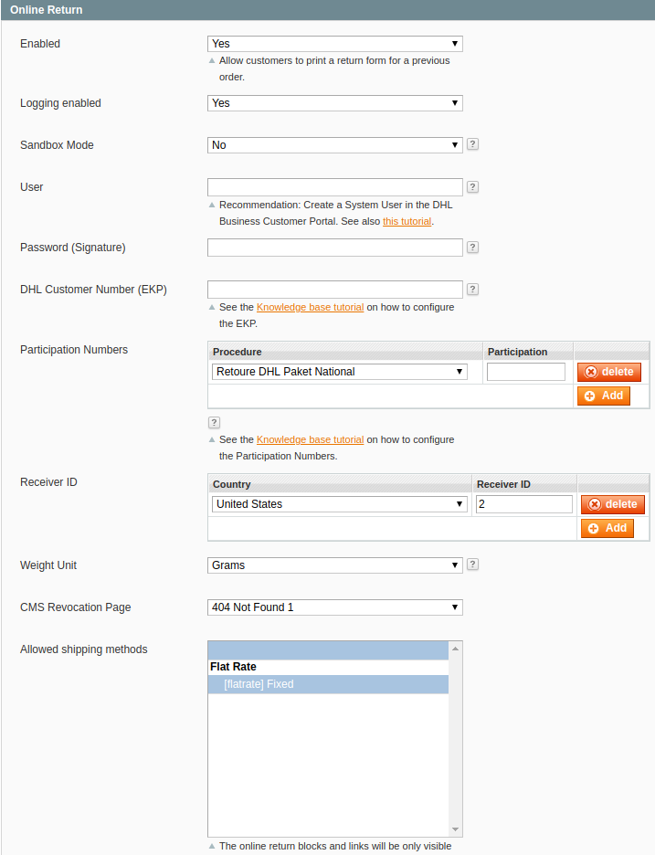

.. |date| date:: %d/%m/%Y
.. |year| date:: %Y

.. footer::
   .. class:: footertable

   +-------------------------+-------------------------+
   | Stand: |date|           | .. class:: rightalign   |
   |                         |                         |
   |                         | ###Page###/###Total###  |
   +-------------------------+-------------------------+

.. header::
   .. image:: images/dhl.jpg
      :width: 4.5cm
      :height: 1.0cm
      :align: right

.. sectnum::

=================================
DHL Online Returns for Magento® 1
=================================

The extension *DHL Online Returns* for Magento® 1 enables customers to create a return shipment
label directly in the shop and print it themselves. It is also possible to download a QR code
to have the label printed in a postal facility (parcel shop, post office).

This documentation covers the **installation, configuration, and usage** of the extension.

.. raw:: pdf

   PageBreak

.. contents:: Installation, configuration, and usage

.. raw:: pdf

   PageBreak

Requirements
===============

The following requirements must be met for a smooth operation of the extension.

Magento®
--------

The following Magento® versions are supported:

- Community-Edition (Open Source) 1.7, 1.8, 1.9
- Enterprise-Edition (Commerce) 1.12, 1.13, 1.14

Server
------

- PHP 5.5 or higher must be installed on the server.
- The PHP extensions JSON and GD must be installed and enabled.

Hints for using the extension
========================================

Language support
-------------------

The extension supports the locales *en_US* and *de_DE*. The translations are stored
in CSV translation files and can therefore be modified by third-party extensions.

Data protection
---------------

The extension transmits personal data to DHL which are needed to process the shipment (names,
addresses, etc.).

The merchant needs the agreement from the customer to process the data, e.g. via the shop's
terms and conditions and / or an agreement in the checkout (Magento® Checkout Agreements).

Installation
============

If you acquired the module package from `Magento Marketplace <https://marketplace.magento.com/dhl-dhl-onlineretoure.html>`_,
then install it via the Magento Connect Manager by using the extension key "Dhl_OnlineRetoure".

The `DHL Online Retoure Extension on GitHub <https://github.com/netresearch/dhl-online-retoure-m1>`_
is also available for installing the package via `Composer <https://getcomposer.org/>`_.

Configuration
=============

The **configuration** for the extension can be found here:

::

  System → Configuration → Sales → Shipping Settings → Online Return

You can configure these **settings**:

.. list-table::
   :widths: 15 30
   :header-rows: 1

   * - Name
     - Description
   * - Enabled
     - Set to *Yes* in order to show the return link on the *Order View* page in customer account as well as in the transactional emails (if configured).
   * - Enable Logging
     - Set to *Yes* in order to log entries to the *var/log/dhl_retoure.log* file. This helps to identify and resolve problems more quickly.
       **Recommendation:** enable this only during troubleshooting.
   * - Sandbox Mode
     - The sandbox mode allows testing without entering a username, password, or DHL customer number.
   * - User
     - DHL Business Customer Portal user, must be authorized to create return shipment labels.
   * - Password (Signature)
     - Password for the DHL Webservice (API). This can be created in the DHL Business Customer Portal.
   * - DHL Customer Number (EKP)
     - DHL customer number (account number / EKP) from the DHL Business Customer Portal.
   * - Participation Numbers
     - The last two characters of the accounting number for the referring product.
   * - Receiver ID
     - Receiver IDs can be edited by selecting "Settings" from the "Returns" menu in the DHL Business Customer Portal.
   * - Weight Unit
     - Select the weight unit that is used in your product catalog.
   * - CMS revocation page
     - A link to this CMS page will be displayed to the customer when creating a return label.
   * - Allowed shipping methods
     - Select which shipping methods should be allowed for returns.

.. raw:: pdf

   PageBreak

Integration into transactional emails
=========================================

You can add a link to the transactional emails which allows the customer to create a return label directly without
logging in to the shop.

Magento®'s transactional emails can be configured in the admin panel in this section:

::

  System → Transactional emails

Return block
--------------

To add the block for creating return labels to the transactional emails, the following code must be added
to Magento®'s transactional email templates:

::

  {{block type='dhlonlineretoure/sales_order_email_retoure'
    area='frontend'
    template='dhl_onlineretoure/sales/order/email/retoure.phtml'
    order=$order}}

A suitable position would be below the shipping information.

**Example:**

.. raw:: pdf

   PageBreak

**Resulting email:**

The integration into these transactional emails has been tested:

* New shipment
* New shipment (guest)

However, the code block works in all transactional emails which have access to the order via the
function *getOrder()* or the variable *$order*.

The template *dhl_onlineretoure/sales/order/email/retoure.phtml* is located in the default path *base/default*
and can be overwritten by other templates as usual.

Alternatively, you can provide a completely different path, if needed.

.. raw:: pdf

   PageBreak

Return link
-------------

If you do not want to include the entire block but only the link to the return form,
you can use the template *dhl_onlineretoure/sales/order/email/retoure_link.phtml*:

::

  <a href="{{block type='dhlonlineretoure/sales_order_email_retoure'
    area='frontend' template='dhl_onlineretoure/sales/order/email/retoure_link.phtml'
    order=$order}}">Individueller Link zur Online Retoure</a>

**Example:**

**Resulting email:**

.. image:: images/en/new_shipment_email_link.png
   :scale: 220 %

Workflow
========

Creating return labels from the customer account
----------------------------------------------------

To create a return label from the customer account, follow these steps:

* Log in to the shop frontend
* In the customer account, go to *My Orders*

* Open the order you want to return, and click the return link.

.. image:: images/en/createlabel-02-order_view.png
   :scale: 195 %

* Check the shipping address, and correct it if necessary
* Click *Generate Return Form*

.. image:: images/en/createlabel-03-address_confirmation.png
   :scale: 195 %

.. raw:: pdf

   PageBreak

* Download the PDF file, open it, and print the label
* Alternatively, show the QR code in a DHL postal facility to have the label printed there

.. image:: images/en/createlabel-04-return_label.png
   :scale: 220 %

As soon as a return label has been created, a note will appear in the Magento® admin panel in the order comments.

.. image:: images/en/createlabel-05-comments_history.png
   :scale: 200 %

**Please note:**

The link for creating an online return will only be displayed in the customer account if

* the order for the return exists,
* a shipment has been created for the order,
* the customer is logged in to the account,
* the order has been created by the logged in customer,
* a receiver ID has been configured for the sender address (customer's country),
* the shipping method of the order is linked to *DHL Online Return* in the `Configuration`_.

.. raw:: pdf

   PageBreak

Creating return labels using the email link
--------------------------------------------

If the customer clicks the return link in a transactional email, the workflow is nearly identical to
`Creating return labels from the customer account`_.

However, the customer does not have to be logged in to the shop. Possessing the link is sufficient
to generate the return shipment label.

See also `Integration into transactional emails`_.

Uninstallation
==============

To uninstall the extension, perform the following steps:

* Remove all extension files from your Magento installation.
* Revoke block permissions at *System → Permissions → Blocks*.
* Clean up the database.

::

    DELETE FROM `core_config_data` WHERE `path` LIKE 'shipping/dhlonlineretoure/%';
    DELETE FROM `core_resource` WHERE `code` = 'dhl_onlineretoure_setup';

Technical support
===================

In case of questions or problems, please have a look at the Support Portal
(FAQ) first: http://dhl.support.netresearch.de/

If the problem cannot be resolved, you can contact the support team via the
Support Portal or by sending an email to dhl.support@netresearch.de
